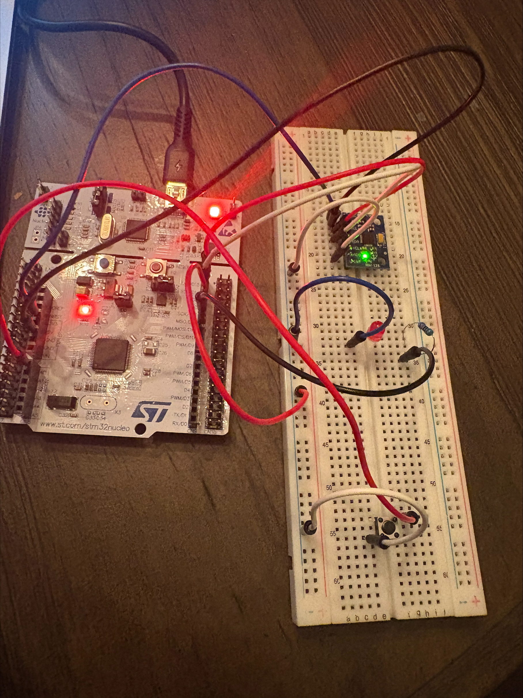
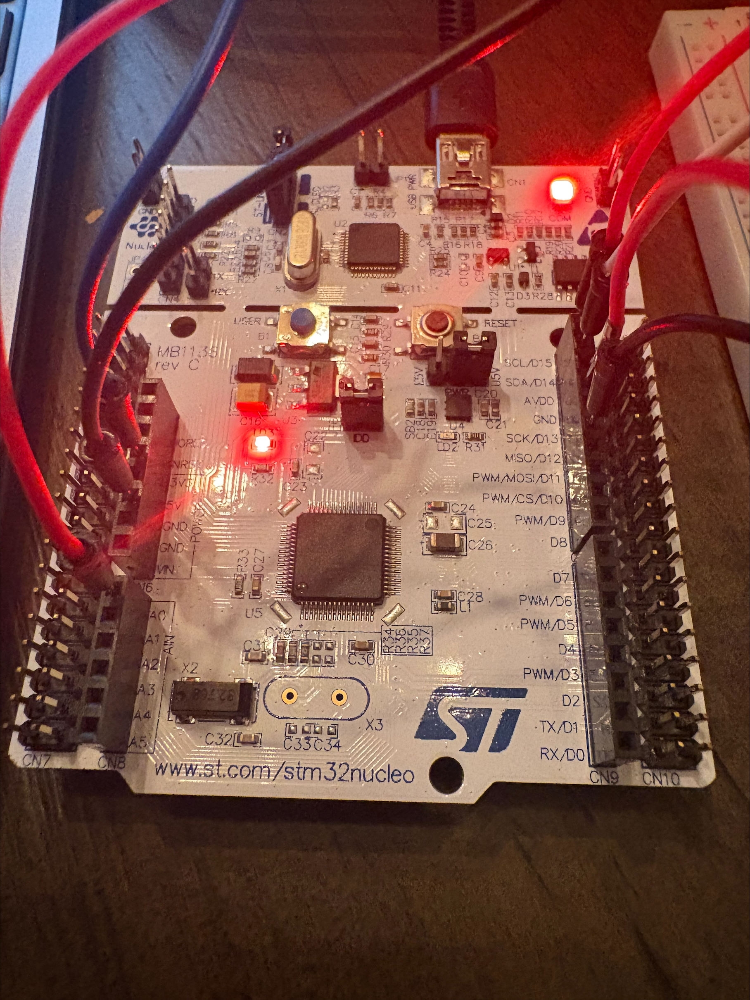
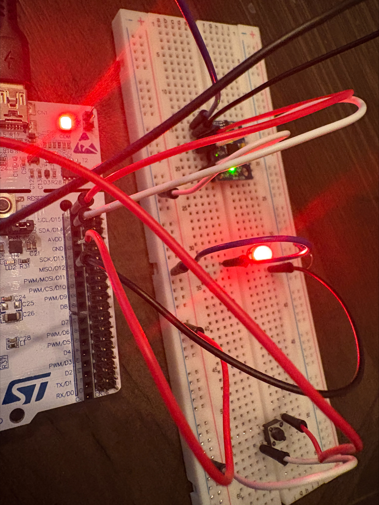
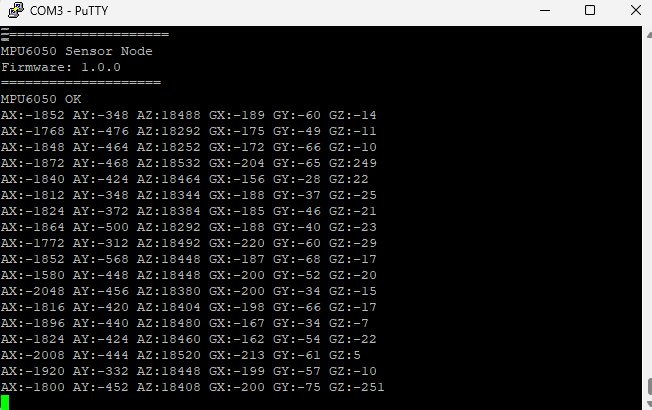
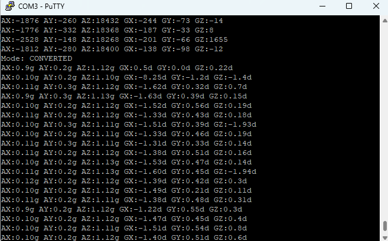
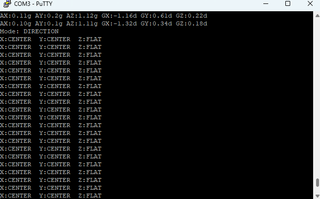
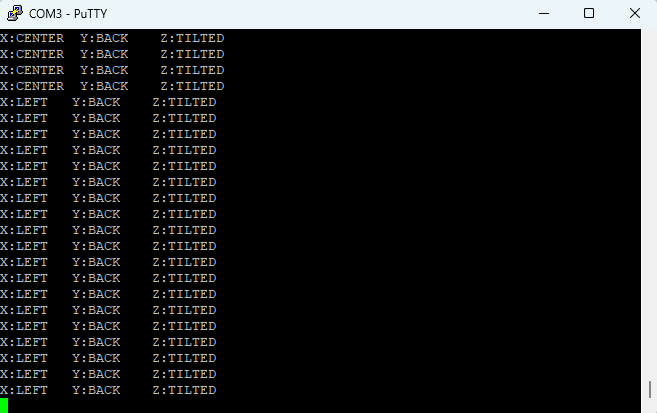

# STM32 MPU6050 Bare-Metal Driver

Bare-metal driver for the InvenSense MPU-6050 6-axis IMU on the STM32 Nucleo-F446RE.
Written from scratch with no HAL, no BSP, and no external libraries — direct register access only.

Reads accelerometer and gyroscope data over I2C1 and streams output over USART2 at 115200 baud.
A button press cycles through three output modes in real time.

---

## Features

- Custom register-level drivers for GPIO, I2C1, USART2, SysTick, EXTI, and NVIC
- Three output modes switchable via button press:
  - **RAW** — raw 16-bit signed counts direct from sensor registers
  - **CONVERTED** — scaled to g (accelerometer) and degrees/second (gyroscope)
  - **DIRECTION** — tilt direction (LEFT / RIGHT / CENTER / FORWARD / BACK / FLAT / TILTED)
- 1ms SysTick timebase for non-blocking delays and elapsed time tracking
- Falling edge EXTI interrupt on PA0
- Heartbeat LED on PA6 blinking at 1Hz
- WHO_AM_I verification on startup — halts with error LED blink if sensor not found
- Fully documented with Doxygen-style comments

---

## Hardware

| Component         | Details                        |
|-------------------|--------------------------------|
| Microcontroller   | STM32 Nucleo-F446RE (Cortex-M4)|
| IMU Sensor        | InvenSense MPU-6050            |
| LED               | External LED with resistor     |
| Button            | Tactile pushbutton             |
| Wires             | Jumper wires                   |

---

## Pin Connections

| Signal      | STM32 Pin | MPU6050 / Component |
|-------------|-----------|----------------------|
| I2C1 SCL    | PB8       | SCL                  |
| I2C1 SDA    | PB9       | SDA                  |
| 3.3V        | 3.3V      | VCC                  |
| GND         | GND       | GND, AD0             |
| Button      | PA0       | Pushbutton           |
| LED         | PA6       | LED + resistor → GND |
| UART TX     | PA2       | ST-Link (automatic)  |
| UART RX     | PA3       | ST-Link (automatic)  |

> AD0 tied to GND sets I2C address to 0x68

---

## Hardware Setup





---

## Output Modes

### RAW Mode
Raw 16-bit signed counts directly from the MPU-6050 registers.



### CONVERTED Mode
Accelerometer scaled to g, gyroscope scaled to degrees/second.
Uses integer arithmetic only — no floating point.



### DIRECTION Mode
Tilt direction based on configurable thresholds.
X/Y threshold: 3000 counts (~0.18g). Z flat threshold: 14000 counts (~0.85g).




---

## Project Structure

```
stm32_mpu6050-driver/
├── Inc/
│   ├── gpio.h
│   ├── i2c.h
│   ├── uart.h
│   ├── mpu6050.h
│   ├── exti.h
│   ├── nvic.h
│   ├── rcc.h
│   └── systick.h
├── Src/
│   ├── main.c
│   ├── gpio.c
│   ├── i2c.c
│   ├── uart.c
│   ├── mpu6050.c
│   ├── exti.c
│   ├── nvic.c
│   └── systick.c
└── images/
```

---

## How to Use

### Requirements
- STM32CubeIDE
- STM32 Nucleo-F446RE
- PuTTY or any serial terminal (115200 baud, 8N1)

### Build and Flash
1. Clone the repository
2. Open STM32CubeIDE and import the project
3. Build and flash to the Nucleo board
4. Open a serial terminal at **115200 baud**
5. Press the button on **PA0** to cycle through output modes

---

## Serial Terminal Settings

| Setting   | Value  |
|-----------|--------|
| Baud rate | 115200 |
| Data bits | 8      |
| Stop bits | 1      |
| Parity    | None   |
| Port      | COMx (check Device Manager) |

---

## Driver Overview

| Driver      | Peripheral | Description                                      |
|-------------|------------|--------------------------------------------------|
| `gpio.c`    | GPIOA/B    | Pin init, read, write, toggle                    |
| `i2c.c`     | I2C1       | Single byte write, single byte read, burst read  |
| `uart.c`    | USART2     | Char, string, and integer transmit               |
| `mpu6050.c` | MPU-6050   | Init, WHO_AM_I, accel/gyro read, formatted print |
| `exti.c`    | EXTI0      | Falling edge interrupt, flag-based polling       |
| `nvic.c`    | NVIC       | IRQ enable/disable and priority configuration    |
| `systick.c` | SysTick    | 1ms tick, blocking delay, elapsed time check     |

---

## Development Environment

- **IDE:** STM32CubeIDE 2.1.1
- **Toolchain:** arm-none-eabi-gcc 14.3
- **Target:** STM32F446RE — Cortex-M4 @ 16MHz HSI
- **No HAL. No BSP. No CMSIS drivers.**

---

## License

MIT License — free to use, modify, and distribute.
